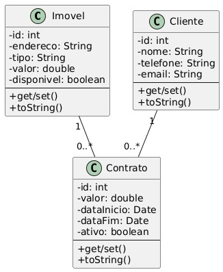
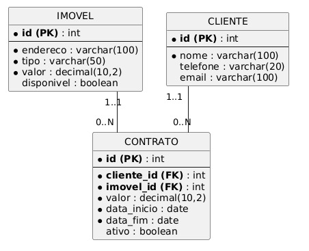

# 🏠 Sistema de Aluguel de Imóveis

Projeto acadêmico desenvolvido em **Java** com **JDBC** e **Maven**, voltado para o gerenciamento de uma imobiliária.  
O sistema possibilita o **cadastro, consulta e gerenciamento** de imóveis, clientes e contratos de aluguel, além da geração de relatórios simples para apoio às operações.

---

## 📌 Funcionalidades

- ✅ Cadastro de imóveis com suas características  
- ✅ Cadastro de clientes  
- ✅ Registro de contratos de aluguel (valor, data de início, data de término, etc.)  
- ✅ Listagem de imóveis disponíveis para aluguel  
- ✅ Consulta de clientes cadastrados  
- ✅ Listagem de contratos ativos  

---

## ⚙️ Tecnologias Utilizadas

- **Java 17+**  
- **Maven**  
- **JDBC**  
- **MySQL**  
- **IntelliJ IDEA** (IDE utilizada no desenvolvimento)  

---

## 🏗️ Arquitetura do Projeto

O sistema segue uma arquitetura em **camadas**, separando responsabilidades de forma organizada:

- **Main (`main/Main.java`)**  
  - Classe principal da aplicação.  
  - Exibe o menu interativo no console.  
  - Encaminha as requisições para a camada DAO.  

- **Modelos (`imobiliaria/`)**  
  - Contém as entidades principais: `Cliente`, `Imovel` e `Contrato`.  
  - Representam as tabelas do banco de dados.  

- **DAO (`daoimobiliaria/`)**  
  - Responsável pela comunicação com o banco de dados via JDBC.  
  - Exemplo: `ClienteDAO` implementa operações de cadastro, busca e listagem de clientes.  

- **Conexão (`conexaoimobiliaria/`)**  
  - Contém a classe `ConexaoImobiliaria`, responsável por abrir e encerrar conexões com o banco.  

- **Scripts (`scripts/`)**  
  - Inclui o arquivo SQL para criação e inicialização das tabelas do banco de dados.
-----------------------------------------------------------------------------------------
CREATE DATABASE Imobiliaria;
USE Imobiliaria;

CREATE TABLE Imovel (
    id INT PRIMARY KEY AUTO_INCREMENT,
    endereco VARCHAR(255),
    tipo VARCHAR(50),
    quartos INT,
    valor_aluguel DOUBLE,
    disponivel BOOLEAN
);

CREATE TABLE Cliente (
    id INT PRIMARY KEY AUTO_INCREMENT,
    nome VARCHAR(100),
    cpf VARCHAR(15),
    telefone VARCHAR(20),
    email VARCHAR(100)
);

CREATE TABLE Contrato (
    id INT PRIMARY KEY AUTO_INCREMENT,
    imovel_id INT,
    cliente_id INT,
    cliente_id DOUBLE,
    data_inicio DATE,
    data_fim DATE,
    ativo BOOLEAN,
    FOREIGN KEY (imovel_id) REFERENCES Imovel(id),
    FOREIGN KEY (cliente_id) REFERENCES Cliente(id)
);

INSERT INTO Imovel (endereco, tipo, quartos, valor_aluguel, disponivel) VALUES
('Rua C, 789', 'Apartamento', 1, 900, true),
('Av. Central, 101', 'Casa', 4, 2500, true),
('Rua das Flores, 202', 'Apartamento', 3, 1800, true),
('Rua Nova, 303', 'Casa', 2, 1500, true),
('Av. Brasil, 404', 'Apartamento', 2, 1300, true);

INSERT INTO Cliente (nome, cpf, telefone, email) VALUES
('Carlos Pereira', '11122233344', '11977777777', 'carlos@email.com'),
('Ana Lima', '55566677788', '11966666666', 'ana@email.com'),
('Roberto Alves', '99988877766', '11955555555', 'roberto@email.com'),
('Fernanda Costa', '33344455566', '11944444444', 'fernanda@email.com'),
('Marcos Oliveira', '77788899900', '11933333333', 'marcos@email.com');

INSERT INTO Contrato (imovel_id, cliente_id, valor, data_inicio, data_fim, ativo) VALUES
(1, 1, 1200, '2025-07-01', '2026-06-30', true),
(2, 2, 2000, '2025-06-15', '2026-06-14', true),
(3, 3, 900, '2025-05-01', '2025-10-30', true),
(4, 4, 2500, '2025-04-01', '2025-09-30', true),
(5, 5, 1300, '2025-03-15', '2025-09-14', true),
(1, 2, 1200, '2024-07-01', '2025-06-30', false),
(2, 3, 2000, '2024-06-15', '2025-06-14', false);

--------------------------------------------------------------------------------------
- **Testes (`test/`)**  
  - Contém testes automatizados utilizando JUnit (em expansão).

## 📊 Diagrama UML

## 🗄️ Modelo ER

